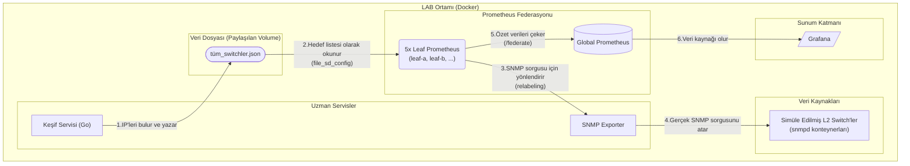

# Proje Amacı

Bu LAB projesinin amacı, daha önce teorik olarak tasarladığımız federasyonlu ve uzman Go servislerine dayalı gözlemci mimarisinin çalışan bir prototipini oluşturmaktır.

# LAB Ortamı ve Bileşenler

Tüm altyapıyı kendi bilgisayarında `Docker` ve `docker-compose` kullanarak simüle edeceğiz. Kuracağımız bileşenler:

- **Simüle Edilmiş L2 Switch'ler:** Gerçek switch'ler yerine, SNMP isteklerine cevap veren basit `snmpd` konteynerları kullanacağız.
- **Keşif Servisi (Go):** Hedefleri bir JSON dosyasına yazan, Go ile yazılmış bir servis.
- **SNMP Exporter:** Prometheus topluluğunun standart `snmp_exporter`'ını kullanacağız.
- **Prometheus Federasyonu:** 5 adet "Leaf" ve 1 adet "Global" olmak üzere toplam 6 Prometheus konteyneri.
- **Grafana:** Verileri görselleştirmek için.



# Proje Dizin Yapısı

İşe başlamadan önce, projenin klasör yapısını aşağıdaki gibi oluştur. Tüm konfigürasyon dosyalarını doğru yerlere koymak çok önemli.

```
l2-observer-lab/
├── docker-compose.yml
├── discovery/
│   ├── main.go
│   ├── Dockerfile
│   └── targets/
│       └── tüm_switchler.json  (Bu dosya servis tarafından oluşturulacak)
├── prometheus/
│   ├── global/
│   │   └── prometheus.yml
│   ├── leaf-a/
│   │   └── prometheus.yml
│   ├── leaf-b/
│   │   └── prometheus.yml
│   ├── leaf-c/
│   │   └── prometheus.yml
│   ├── leaf-d/
│   │   └── prometheus.yml
│   └── leaf-e/
│       └── prometheus.yml
└── snmp-exporter/
    └── snmp.yml
```

# Adım Adım Kurulum

## Adım 1: SNMP Exporter Yapılandırması

`snmp-exporter/snmp.yml` dosyasını oluştur ve içine aşağıdaki temel konfigürasyonu ekle. Bu, sadece cihazın ayakta olup olmadığını kontrol etmek için yeterli.

```yaml
# snmp-exporter/snmp.yml
if_mib:
  walk:
    - 1.3.6.1.2.1.2 # if-mib
  metrics:
    - name: ifOperStatus
      oid: 1.3.6.1.2.1.2.2.1.8
      type: EnumAsInfo
      help: The operational status of the interface
```

## Adım 2: Keşif Servisi (Go Versiyonu)

Python simülasyonu yerine, aşağıdaki Go kodunu kullanacağız.

`discovery/main.go` dosyasını oluştur:

```go
// discovery/main.go
package main

import (
	"encoding/json"
	"log"
	"os"
	"time"
)

// Prometheus hedef dosyasının yapısı
type TargetGroup struct {
	Targets []string          `json:"targets"`
	Labels  map[string]string `json:"labels"`
}

// Simüle edilmiş switch bilgileri
type SimulatedSwitch struct {
	IP    string
	Bolge string
}

func generateTargets() {
	simulatedSwitches := []SimulatedSwitch{
		{IP: "172.20.0.10", Bolge: "A_Veri_Merkezi"},
		{IP: "172.20.0.11", Bolge: "A_Veri_Merkezi"},
		{IP: "172.20.0.20", Bolge: "B_Veri_Merkezi"},
		{IP: "172.20.0.30", Bolge: "C_Veri_Merkezi"},
	}

	targetsByRegion := make(map[string][]string)
	for _, s := range simulatedSwitches {
		targetsByRegion[s.Bolge] = append(targetsByRegion[s.Bolge], s.IP)
	}

	var prometheusTargets []TargetGroup
	for bolge, ips := range targetsByRegion {
		prometheusTargets = append(prometheusTargets, TargetGroup{
			Targets: ips,
			Labels:  map[string]string{"bolge": bolge},
		})
	}

	// Dosyayı yazacağımız dizinin var olduğundan emin ol
	if err := os.MkdirAll("targets", 0755); err != nil {
		log.Fatalf("Dizin oluşturulamadı: %v", err)
	}

	// JSON dosyasına yaz
	file, err := json.MarshalIndent(prometheusTargets, "", "  ")
	if err != nil {
		log.Fatalf("JSON oluşturulamadı: %v", err)
	}

	err = os.WriteFile("targets/tüm_switchler.json", file, 0644)
	if err != nil {
		log.Fatalf("Dosya yazılamadı: %v", err)
	}

	log.Println("Hedef dosyası 'tüm_switchler.json' güncellendi.")
}

func main() {
	for {
		generateTargets()
		time.Sleep(60 * time.Second) // Her 60 saniyede bir çalış
	}
}
```

`discovery/Dockerfile` dosyasını oluştur. Bu, Go servisini bir Docker konteynerine paketleyecek.

```dockerfile
# discovery/Dockerfile
# --- Build Stage ---
FROM golang:1.19-alpine AS builder
WORKDIR /app
COPY go.mod ./
COPY go.sum ./
RUN go mod download
COPY *.go ./
RUN CGO_ENABLED=0 GOOS=linux go build -o /discovery-service

# --- Final Stage ---
FROM scratch
COPY --from=builder /discovery-service /discovery-service
CMD ["/discovery-service"]
```

_(Not: Bu basit örnek için `go.mod` dosyası gerekmez, ama gerçek projeler için eklemek iyi bir alışkanlıktır.)_

## Adım 3: Prometheus Yapılandırması

**Leaf Prometheus (Örnek: leaf-a):** `prometheus/leaf-a/prometheus.yml` dosyasını oluştur. Diğer Leafler için de (`leaf-b`, `leaf-c` vb.) bu dosyayı kopyalayıp sadece `prometheus_bolge` ve `regex` değerlerini değiştireceksin.

```yaml
# prometheus/leaf-a/prometheus.yml
global:
  scrape_interval: 15s
  external_labels:
    prometheus_bolge: "A_Veri_Merkezi" # Bu Leaf'in kimliği

scrape_configs:
  - job_name: "snmp-switchler"
    file_sd_configs:
      - files:
          - "/etc/prometheus/targets/tüm_switchler.json"
    relabel_configs:
      # 1. Sadece bu Leaf'in bölgesine ait hedefleri tut, diğerlerini at
      - source_labels: [bolge]
        regex: "A_Veri_Merkezi"
        action: keep
      # 2. SNMP Exporter'a yönlendirme
      - source_labels: [__address__]
        target_label: __param_target
      - source_labels: [__param_target]
        target_label: __address__
        replacement: "snmp-exporter:9116"
```

**Global Prometheus:** `prometheus/global/prometheus.yml` dosyasını oluştur. Bu, tüm Leaf'lerden veri toplayacak.

```yaml
# prometheus/global/prometheus.yml
global:
  scrape_interval: 30s

scrape_configs:
  - job_name: "federate"
    honor_labels: true
    metrics_path: "/federate"
    params:
      "match[]":
        - '{job="snmp-switchler"}'
    static_configs:
      - targets:
          - "leaf-a:9090"
          - "leaf-b:9090"
          - "leaf-c:9090"
          - "leaf-d:9090"
          - "leaf-e:9090"
```

## Adım 4: Her Şeyi Birleştiren Docker Compose

Projenin ana dizinindeki `docker-compose.yml` dosyasını oluştur. Keşif servisi artık Go uygulamamızı build edecek.

```yaml
# docker-compose.yml
version: "3.8"

services:
  discovery-service:
    build: ./discovery
    volumes:
      - ./discovery/targets:/app/targets
    networks:
      - lab_net

  snmp-exporter:
    image: prom/snmp-exporter:latest
    volumes:
      - ./snmp-exporter/snmp.yml:/etc/snmp_exporter/snmp.yml
    ports:
      - "9116:9116"
    networks:
      - lab_net

  # --- Simüle Edilmiş Switch'ler ---
  switch-a-1:
    image: roenvan/snmpd:latest
    hostname: switch-a-1
    networks:
      lab_net:
        ipv4_address: 172.20.0.10

  switch-b-1:
    image: roenvan/snmpd:latest
    hostname: switch-b-1
    networks:
      lab_net:
        ipv4_address: 172.20.0.20

  # --- Leaf Prometheus Sunucuları ---
  leaf-a:
    image: prom/prometheus:latest
    volumes:
      - ./prometheus/leaf-a:/etc/prometheus
      - ./discovery/targets:/etc/prometheus/targets
    command: "--config.file=/etc/prometheus/prometheus.yml"
    networks:
      - lab_net

  leaf-b:
    image: prom/prometheus:latest
    volumes:
      - ./prometheus/leaf-b:/etc/prometheus
      - ./discovery/targets:/etc/prometheus/targets
    command: "--config.file=/etc/prometheus/prometheus.yml"
    networks:
      - lab_net
  # ... Diğer leaf-c, leaf-d, leaf-e servisleri de benzer şekilde eklenecek

  # --- Global Prometheus ---
  global-prometheus:
    image: prom/prometheus:latest
    volumes:
      - ./prometheus/global:/etc/prometheus
    command: "--config.file=/etc/prometheus/prometheus.yml"
    ports:
      - "9090:9090" # Global'i dışarı açalım
    networks:
      - lab_net

  grafana:
    image: grafana/grafana:latest
    ports:
      - "3000:3000"
    networks:
      - lab_net

networks:
  lab_net:
    driver: bridge
    ipam:
      driver: default
      config:
        - subnet: 172.20.0.0/16
```

# LAB'ı Çalıştırma ve Doğrulama

1. Terminalde `l2-observer-lab` dizinine git.
2. `docker-compose up -d --build` komutunu çalıştır. (`--build` parametresi Go servisini derlemek için önemli).
3. Birkaç dakika bekle ve doğrulamaları yap:

   - `discovery/targets/tüm_switchler.json` dosyasının oluşup oluşmadığını kontrol et.
   - **Leaf-A'yı Kontrol Et:** Tarayıcıda `http://localhost:XXXX` (docker ps ile portunu bul) aç. "Status" -> "Targets" menüsünde sadece `172.20.0.10` ve `172.20.0.11` IP'lerini görmelisin.
   - **Global'i Kontrol Et:** Tarayıcıda `http://localhost:9090` aç. "Status" -> "Targets" menüsünde `leaf-a:9090`, `leaf-b:9090` gibi hedefleri görmelisin.
   - **Grafana'yı Kontrol Et:** `http://localhost:3000` aç. Yeni bir Prometheus data source ekle (`http://global-prometheus:9090`) ve `up` sorgusuyla verilerin gelip gelmediğini kontrol et.

Bu LAB, tasarladığımız mimarinin tüm temel mekaniklerini canlı olarak test etmeni sağlayacak. Buradan sonra gerçek Go servislerini yazmaya başlayabilirsin kanka!
