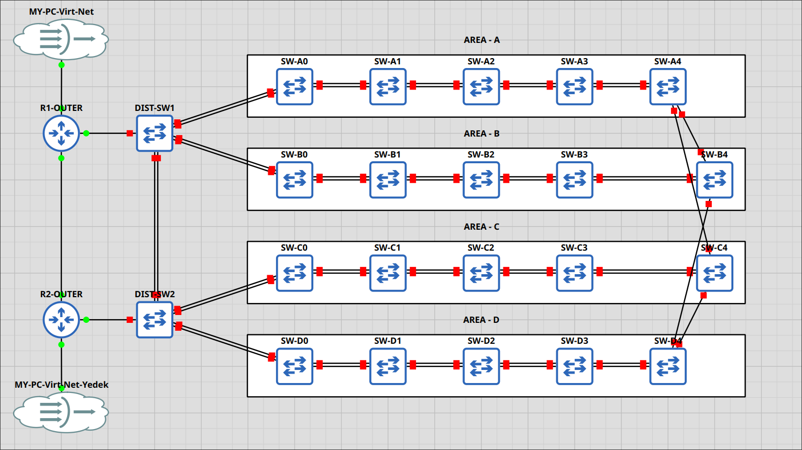

# Router yapısı

Aşağıdaki network topolojisi için konfigurasyon dosyasıdır. Router kısmı bulunurken SWler için Telnet üzerinden otomatik basılacaktır. LAB için hızlı olması adına. Birde fazla network odaklı değil daha çok test amaçlıdır.



## Linux cihazımızda

IP route için routerlara statik yönlendirme:

> GNS3 altındaki NAT ağı 192.168.122.0/24 şeklindedir ve Gateway: 192.168.122.1 olacaktır.

```bash
sudo ip route add 10.0.0.0/24 via 192.168.122.1 dev virbr0
```

## **R1-OUTER** konfigurasyonu

Portlar:

- GigabitEthernet1 <-> dist-sw1: Gi0/0
- GigabitEthernet2 <-> R2-Outer: GigabitEthernet2
- GigabitEthernet4 <-> MY-PC-Virt-Net

```
hostname R1-OUTER
! dist-sw1 - Ana çıkış portu
interface GigabitEthernet1
	desc dist-sw1
	no ip address
	no shutdown
!
interface GigabitEthernet1.10
	encapsulation dot1Q 10
	ip address 192.168.10.2 255.255.255.0
	standby 10 ip 192.168.10.1
	standby 10 priority 150
	standby 10 preempt
!
interface GigabitEthernet1.20
	encapsulation dot1Q 20
	ip address 192.168.20.2 255.255.255.0
	standby 20 ip 192.168.20.1
	standby 20 priority 150
	standby 20 preempt
!
interface GigabitEthernet1.100
	encapsulation dot1Q 100
	ip address 192.168.100.2 255.255.255.0
	standby 100 ip 192.168.100.1
	standby 100 priority 150
	standby 100 preempt
! virtual bridge: 192.168.122.1.0/24 networkünde çalışıyor.
interface GigabitEthernet4
	desc MY-PC-Virt-Net
	ip address 192.168.122.2 255.255.255.0
	no shutdown
!
interface GigabitEthernet2
	desc R2-Outer
 no shut
	ip address 10.0.0.1 255.255.255.0
! Linux makinemize statik route
ip route 192.168.122.0 255.255.255.0 192.168.122.1
```

## **R2-OUTER** konfigurasyonu

Portlar:

- GigabitEthernet1 <-> dist-sw1: Gi0/0
- GigabitEthernet2 <-> R2-Outer: GigabitEthernet2
- GigabitEthernet4 <-> MY-PC-Virt-Net-Yedek

```
hostname R2-OUTER
! dist-sw1 - Ana çıkış portu
interface GigabitEthernet1
	desc dist-sw2
	no ip address
	no shutdown
!
interface GigabitEthernet1.10
	encapsulation dot1Q 10
	ip address 192.168.10.2 255.255.255.0
	standby 10 ip 192.168.10.1
	standby 10 priority 100
	standby 10 preempt
!
interface GigabitEthernet1.20
	encapsulation dot1Q 20
	ip address 192.168.20.2 255.255.255.0
	standby 20 ip 192.168.20.1
	standby 20 priority 100
	standby 20 preempt
!
interface GigabitEthernet1.100
	encapsulation dot1Q 100
	ip address 192.168.100.2 255.255.255.0
	standby 100 ip 192.168.100.1
	standby 100 priority 100
	standby 100 preempt
! virtual bridge: 192.168.122.1.0/24 networkünde çalışıyor.
interface GigabitEthernet4
	desc MY-PC-Virt-Net-Yedek
	ip address 192.168.122.3 255.255.255.0
	no shutdown
interface GigabitEthernet2
	desc R1-Outer
 no shut
	ip address 10.0.0.2 255.255.255.0
! Linux makinemize statik route
ip route 192.168.122.0 255.255.255.0 192.168.122.1
```
